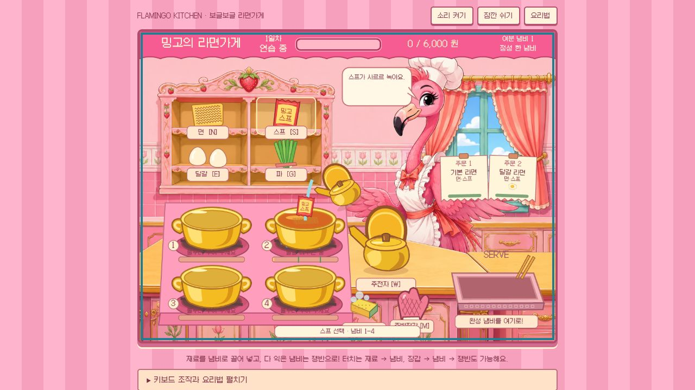

# 밍고의 보글보글 라면가게

네 개의 냄비를 돌려 손님 주문을 맞추는 독립 요리 게임. 슈의 라면가게의 **재료 집기 → 물 붓기 → 끓일 때 토핑 → 장갑으로 쟁반 서빙** 감각을 새 플라밍고 주방으로 만든 비공식 패러디입니다. 기존 아케이드 모음의 공통 엔진·화면·캐릭터를 사용하지 않습니다.



[소스 코드](src/) · [실제 브라우저 검증](docs/browser-qa.md) · [원화와 제작 기록](docs/art-direction.md)

## 실행

Node.js 22.12 이상이 필요합니다. API 키, 계정, 외부 콘텐츠 서버가 필요 없습니다.

```sh
npm ci
npm test
npm run build
npm run dev
```

[로컬 주방 열기](http://127.0.0.1:4201/) · 포트 4201을 고정 사용하며 점유되면 다른 포트로 바꾸지 않고 종료합니다. Sites 설정·배포·원격 게임 래퍼는 없습니다.

## 조작

- 마우스/펜: 선반 재료나 주전자를 냄비에 드래그. 장갑 선택 후 냄비를 쟁반에 드래그합니다.
- 터치: 같은 드래그 또는 **도구 탭 → 냄비 탭**. 서빙은 **장갑 탭 → 냄비 탭 → 쟁반 탭**.
- 키보드: `W` 물, `N` 면, `S` 스프, `E` 달걀, `G` 파. 고른 후 `1`–`4`로 냄비 지정. `M` → 냄비 번호 → `Enter` 서빙. `X` → 냄비 번호 설거지. `Esc` 취소, `P` 일시정지.
- 화면 아래 펼치는 조작판에 같은 기능의 일반 HTML 버튼을 제공합니다.

물·면·스프를 넣고 5초 뒤 보글거리면 주문에 맞는 파와 달걀을 넣으세요. 면 익힘 막대의 두 초록 선 사이(면을 넣은 뒤 7–13초)가 완벽한 타이밍입니다. 주문이 다른 라면은 서빙되지 않습니다. 완벽한 요리 연속 성공은 최대 300원 팁. 탄 냄비는 하루 여분 3개까지 교체할 수 있습니다.

첫째 날 6,000원, 둘째 날 10,000원, 셋째 날 14,000원을 목표로 3일 영업합니다. 연습 모드는 손님과 영업시간이 기다려 주지만 조리 시간은 그대로라 익힘을 연습할 수 있습니다. 탭을 숨기거나 창을 벗어나면 자동 일시정지됩니다. 소리는 기본 꺼짐입니다.

## 검증과 범위

`npm test`는 독립 냄비, 레시피, 물/재료 중복, 생면/탄 냄비, 토핑 시점, 주문 실패/팁, 시간 제한, 연습, 일시정지, 히트박스, **점수나 상태 조작 없이 정상 조리 입력으로 3일 캠페인 완주**를 검사합니다. `npm run capture`는 CPU 아트 프리뷰를 다시 만듭니다.

실제 브라우저에서 드래그 조리·1,000원 판매·키보드 서빙·일시정지·요리법 복귀를 확인했습니다. [검증 기록과 남은 범위](docs/browser-qa.md)를 참고하세요. 모바일 실제 기기·오디오 청취·브라우저 3일 완주는 미검증이며, CPU 테스트 통과와 구분합니다.

## 소스와 자산

[원작 화면 참고와 구체적인 아트 결정](docs/art-direction.md) · [폰트 라이선스](public/fonts/OFL.md)

`src/engine.js` 순수 조리/주문 상태, `src/art.js` 직접 그린 주방 소품, `src/renderer.js` 1200×900 무대와 일치하는 히트박스, `src/main.js` 포인터·키보드·메뉴·수명 관리로 나뉩니다. 생성된 새 주방 그림만 `public/art/kitchen.png`에서 로드합니다. 원작 SWF, 로고, 인물, 음악, 추출 자산은 포함하지 않습니다. 원작 제작사와 관계없는 팬 패러디입니다.
